# Aula 1 — Conhecendo o R {background-color="#2c3e50"}

## Introdução ao Ambiente {background-color="#34495e"}

### Passos iniciais {.smaller}

- R é um software de **programação estatística**

:::{.callout-note}
Tem dividido com o Python o posto de software mais popular entre cientistas sociais
:::

- Vantagens:
  - Software Livre
  - Documentação completa e acessível
  - Diversidade de formatos de arquivo
  - Replicabilidade de rotinas

### Um Excel que usou o suco? {.smaller}

- Se é possível fazer no Excel, é possível no R
- Entretanto, se é possível fazer no R, **não** necessariamente é possível fazer no Excel

Vários cálculos estatísticos mais sofisticados estão disponíveis no R através de **pacotes** desenvolvidos pela comunidade

### Habilidades necessárias {.smaller}

**Escrita:** elementos (`numeric`, `character`, `factor`), funções básicas (`sum()`, `table()`, `sd()`), composição do script (`c()`, `for`)

**Leitura:** identificação de funções, diferentes soluções, alertas de erros

:::{.callout-important}
Adquirir **autonomia** com o software — a habilidade mais importante é **saber pesquisar**
:::

- [Stack Overflow](https://stackoverflow.com/) e [Posit Community](https://community.rstudio.com/)

### A IA mudou tudo: O novo fluxo de trabalho {.smaller}

- **De codificador a revisor:** A habilidade central em programação estatística passou a ser **formular boas instruções** (*prompts*) e **revisar criticamente** o código gerado.
- **Assistente, não substituto:** Modelos são excelentes para explicar mensagens de erro, documentar scripts ou sugerir a estrutura inicial de um gráfico no `ggplot2`.
- **O perigo da alucinação:** IAs podem inventar funções que não existem ou misturam o R base com o `tidyverse`. A validação humana é insubstituível.
- **Sobre autoria, o que valia antes, vale agora:** Nunca execute ou inclua no seu script um bloco de código que você não seja capaz de explicar linha por linha. A responsabilidade metodológica e a reprodutibilidade da pesquisa são inteiramente suas.

## RStudio {background-color="#34495e"}

### RStudio (IDE)

- RStudio é um ambiente de desenvolvimento (IDE) para R
- Ao longo do curso utilizaremos o RStudio

> Posit (<https://posit.co/download/rstudio-desktop/>)

[Posit Cloud (gratuito)](https://posit.cloud/)

### Aparência do RStudio

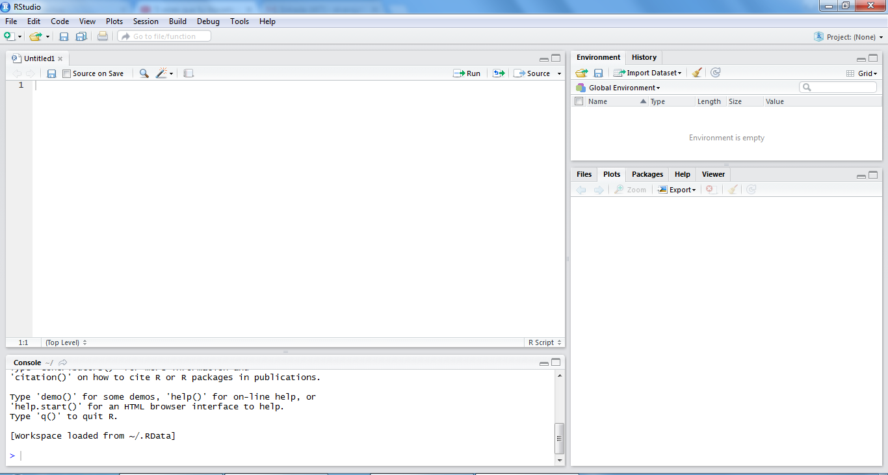

### Básico do básico: um operador e um comando

Linhas escritas no **Script** (arquivos de texto `.R` ou `.qmd`)

`Ctrl + Enter` (ou `Cmd + Enter` no Mac) — **executa** a linha selecionada

`#` — insere **comentários** sem gerar outputs

```{r}
# Isto é um comentário — o R ignora esta linha

5 + 5  # Mas executa isto
```

### R como calculadora

```{r}
5 + 5
5 - 3
4 * 9
16 / 2
```

### Atenção aos parênteses

```{r}
(5 + 6) * 3

5 + 6 * 3
```

Exponencial e raiz quadrada:

```{r}
2 ^ 2

sqrt(36)
```

### Operadores lógicos

```{r}
5 == 5
5 <= 5 / 5
5 * 4 > 5
3 != 6
```

### Testes lógicos

```{r}
TRUE == TRUE
TRUE <= FALSE
```

Também testamos caracteres:

```{r}
"Python" == "python"
"Stata" != "Sasta"
```

### Operadores `&` (E) e `|` (OU)

O **E** precisa que **todos** sejam verdadeiros:

```{r}
(3 == 3) & (4 != 5)
```

O **OU** precisa que **pelo menos um** seja verdadeiro:

```{r}
(3 != 3) | (4 != 5)
```

## Criação de Objetos {background-color="#34495e"}

### Atribuição com `<-`

A "setinha" atribui objetos (valores, vetores, dataframes) a etiquetas:

- Podemos "salvar" os objetos nas etiquetas para utilizá-los ao longo do script
- Quando criamos a etiqueta, **não geramos outputs** — apenas quando rodamos a etiqueta

```{r}
sorte <- 5
sorte
```

### Regras do uso da setinha

Atenção: letras maiúsculas e minúsculas importam

```{r}
#| eval: false

sorte <- 5
Sorte
# Erro: objeto 'Sorte' não encontrado
```

Não podemos criar etiquetas que começam com números:

```{r}
#| eval: false

15luck <- 15
# Erro: unexpected symbol in "15luck"
```

Cuidado com nomes de funções existentes (`c`, `sum`, `data`)

### Classes

Em basicamente tudo no R, a **classe** importa. Três grandes classes elementares:

- `numeric` — números
- `logical` — `TRUE`, `FALSE`, `NA`
- `character` — texto (entre aspas)

**Primeira função:** `class()`

```{r}
class(sorte)
```

### Numérico

- `numeric` é a classe composta por valores numéricos
- Objetos deste tipo permitem funções matemáticas

**Separador de decimais = ponto:**

```{r}
#| eval: false

decimal <- 3,5
# Erro: ',' inesperado in "decimal <- 3,"

decimal <- 3.5  # correto!
```

### Lógico

- `logical` é composta por `TRUE`, `FALSE` e `NA`
- Podemos resumir para `T` e `F`
- Por trás: `TRUE = 1` e `FALSE = 0`

```{r}
vdd <- TRUE
class(vdd)

T + F
```

### Caracteres e Fatores

- `character` é a classe composta por textos (entre **aspas**)
- `factor` apresenta as **categorias** (levels) de um vetor — tratamento distinto em modelos e importação

```{r}
nome <- "Frederico"
class(nome)

partido <- factor(c("PT", "PL", "MDB", "PT", "PL"))
levels(partido)
```

## Vetores {background-color="#34495e"}

### O que são vetores?

- Vetores são **combinações de valores** em uma estrutura unidimensional
- A função `c()` (de *combine*) cria vetores

```{r}
c(2, 4, 6, 8)

c("Pedro", "Paula", "Pietro", "Paloma")

c(TRUE, FALSE, TRUE, FALSE)
```

### Etiquetas e classes de vetores

```{r}
n.pares <- c(2, 4, 6, 8)
nomes.com.p <- c("Pedro", "Paula", "Pietro", "Paloma")
valores.log <- c(TRUE, FALSE, TRUE, FALSE)

class(n.pares)
class(nomes.com.p)
length(n.pares)
```

### Somatório de vetores

Para vetores numéricos, `sum()` corresponde ao $\sum$:

```{r}
sum(n.pares)
```

Em vetores lógicos, soma o número de `TRUE` — funciona como **contador**:

```{r}
sum(valores.log)

sum(nomes.com.p == "Pedro")
```

### Seleção de elementos

Usando `[ ]` por **posição** ou **valor**:

```{r}
nomes.com.p[2]

nomes.com.p[nomes.com.p == "Paula"]
```

Selecionando por **regras**:

```{r}
n.pares[n.pares > median(n.pares)]
```

### Usando `%in%`

Testa se um valor está **contido** no vetor:

```{r}
"Paula" %in% nomes.com.p
```

Operações com vetores:

```{r}
n.pares[n.pares >= 5] * 2
```

## data.frame {background-color="#34495e"}

### data.frame {.smaller}

- Um `data.frame` é o mesmo que uma tabela — como uma planilha
- Cada coluna pode ter uma classe diferente
- O operador `$` acessa colunas

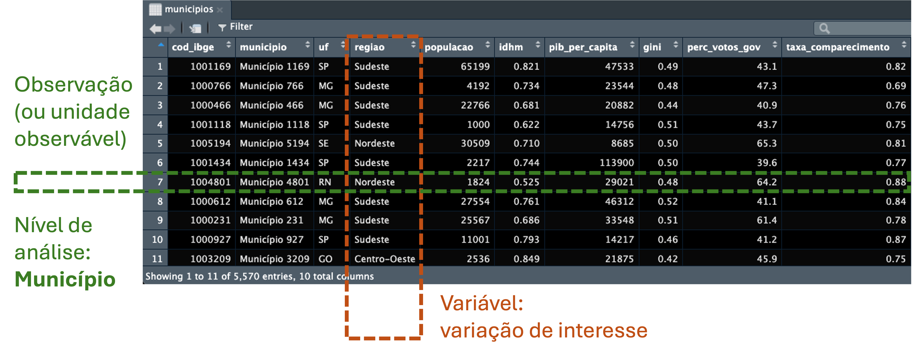

### data.frame de perto

```{r}
df <- data.frame(
  nome = c("SP", "RJ", "MG"),
  populacao = c(46, 17, 21),
  regiao = c("Sudeste", "Sudeste", "Sudeste")
)
df$populacao
```

Funções úteis: `head()`, `tail()`, `dim()`, `names()`, `str()`, `cbind()`, `rbind()`

## Pacotes {background-color="#34495e"}

### O que são pacotes?

- O R possui diversas funções já instaladas (`sum()`, `length()`, `class()`)
- Outras devem ser instaladas através de **pacotes**:
  - Importação de dados, organização, análises, gráficos

```{r}
#| eval: false

install.packages("foreign")   # Instalar
library(foreign)               # Ativar (sem aspas!)
```

### Nossa abordagem no curso

```{r}
#| eval: false
pacman::p_load(tidyverse)
```

:::{.callout-tip}
`pacman::p_load()` instala (se necessário) **e** carrega de uma vez!
:::

### O pipe `|>`

O pipe passa o resultado da esquerda como **primeiro argumento** da direita:

```{r}
x <- c(1, 2, 3, 4)

# Sem pipe (de dentro pra fora):
sqrt(sum(x))

# Com pipe (da esquerda pra direita):
x |> sum() |> sqrt()
```

:::{.callout-note}
Usamos o pipe nativo `|>` do R (≥ 4.1), não o `%>%` do magrittr
:::

### Ceci n'est pas une pipe


### Receita de bolo — sem pipe

```{r}
#| eval: false

esfrie(
  asse(
    coloque(
      bata(
        acrescente(
          recipiente(rep("farinha", 2), "água",
                     "fermento", "leite", "óleo"),
          "farinha", até = "macio"),
        duração = "3min"),
      lugar = "forma", tipo = "grande",
      untada = TRUE), duração = "50min"),
  "geladeira", "20min")
```

### Receita de bolo — com pipe

```{r}
#| eval: false

recipiente(rep("farinha", 2), "água", "fermento", "leite", "óleo") |>
  acrescente("farinha", até = "macio") |>
  bata(duração = "3min") |>
  coloque(lugar = "forma", tipo = "grande", untada = TRUE) |>
  asse(duração = "50min") |>
  esfrie("geladeira", "20min")
```

Leia da esquerda para a direita — muito mais intuitivo!

# Aula 2 — Conhecendo seus Dados {background-color="#2c3e50"}

## Preparação {background-color="#34495e"}

### Setup do curso

```{r}
pacman::p_load(
  tidyverse, scales,
  sf, geobr,
  patchwork, leaflet,
  broom, modelsummary,
  jsonlite, httr2,
  janitor, readxl, haven,
  electionsBR, ipeadatar
)
```

## Importação de dados {background-color="#34495e"}

### Passo a passo da importação

A importação exige atenção a dois pontos:

1. **Onde está o arquivo?** — diretório de trabalho
2. **Qual o formato do arquivo?** — extensão (`.csv`, `.xlsx`, `.rds`, etc.)

:::{.callout-tip}
Usando um **RProject** (`.Rproj`), o diretório de trabalho é definido automaticamente!
:::

### Diretório de trabalho

```{r}
#| eval: false

getwd()                           # Verificar diretório atual
setwd("~/Documents/emcs2026")     # Mudar (evite! Use RProjects)
```

Com um RProject aberto, `getwd()` retorna a pasta do projeto — e todos os caminhos são **relativos** a ela.

### Importação no tidyverse

| Formato | Função | Pacote |
|---------|--------|--------|
| `.csv` | `read_csv()` | readr |
| `.tsv` / `.txt` | `read_delim()` | readr |
| `.xlsx` | `read_xlsx()` | readxl |
| `.dta` (Stata) | `read_dta()` | haven |
| `.rds` | `read_rds()` | readr |

### Lendo nosso dataset do curso

O arquivo `municipios_br.csv` está na pasta `dados/` do projeto:

```{r}
municipios <- read_csv("dados/municipios_br.csv")
```

### Explorando os dados

```{r}
glimpse(municipios)
```

### Verificando a importação

```{r}
dim(municipios)
names(municipios)
n_distinct(municipios$uf)
summary(municipios$idhm)
```

:::{.callout-tip}
Prefira `glimpse()` a `str()` — mais legível e tidy-friendly
:::

### Outros formatos de importação

```{r}
#| eval: false

# Excel com página específica
dados_excel <- read_xlsx("dados/planilha.xlsx", sheet = 2)

# Texto delimitado por tabulação
dados_txt <- read_delim("dados/base.txt", delim = "\t")

# Formato Stata
dados_stata <- read_dta("dados/base.dta")

# Formato nativo R (preserva classes)
dados_rds <- read_rds("dados/base.rds")
```

### Salvando dados

```{r}
#| eval: false

write_csv(municipios, "dados/municipios_processados.csv")
write_rds(municipios, "dados/municipios_processados.rds")
```

:::{.callout-note}
`.rds` preserva classes e é mais compacto — ideal para objetos R
:::

### Importação via pacote: electionsBR

```{r}
#| eval: false

# Dados de candidaturas do DF em 2022
candidatos_df <- candidate_fed(year = 2022, uf = "DF")

glimpse(candidatos_df)
```

:::{.callout-note}
O pacote `electionsBR` acessa dados do TSE diretamente — requer internet
:::

### Importação via pacote: ipeadatar

```{r}
#| eval: false

# Buscar séries disponíveis com IDHM
search_series(terms = "IDHM", fields = "name")

# Baixar dados do IDHM municipal
idhm <- ipeadata("ADH_IDHM")

# Filtrar municípios no ano mais recente
idhm_mun <- idhm |>
  filter(uname == "Municipality") |>
  filter(date == max(date))
```

:::{.callout-note}
O `ipeadatar` acessa o IPEA Data diretamente — mais de 7.000 séries disponíveis!
:::

### Importação via API: Câmara dos Deputados

```{r}
#| eval: false

url <- "https://dadosabertos.camara.leg.br/api/v2/votacoes"

resp <- request(url) |>
  req_url_query(
    dataInicio = "2024-08-01",
    dataFim = "2024-08-31"
  ) |>
  req_perform()

votacoes <- resp |>
  resp_body_json() |>
  pluck("dados")
```

### Fontes de dados para Ciência Política

| Fonte | Pacote/Acesso | Dados |
|-------|---------------|-------|
| TSE | `electionsBR` | Eleições, candidaturas |
| IPEA | `ipeadatar` | Séries históricas, IDH |
| Câmara/Senado | API REST | Votações, proposições |
| IBGE (SIDRA) | `sidrar` | Censo, indicadores |
| CEPESPDATA | `cepespR` | Dados eleitorais |
| V-Dem | `vdemdata` | Indicadores de democracia |

# Aula 3 — Preparando e Manipulando {background-color="#2c3e50"}

## tidyverse {background-color="#34495e"}

### Manifesto tidyverse

O tidyverse é um conjunto de pacotes que compartilham princípios do manifesto *tidy*:

- Reutilizar estruturas de dados existentes
- Organizar funções simples usando o pipe
- Aderir à programação funcional
- Projetado para ser usado por **seres humanos**

Referências: [Tidy Tools Manifesto](https://cran.r-project.org/web/packages/tidyverse/vignettes/manifesto.html) | [R4DS](https://r4ds.hadley.nz/)

### Formato tidy

Hadley Wickham <https://r4ds.hadley.nz/data-tidy>


### Onde estamos

<https://r4ds.hadley.nz/data-transform>

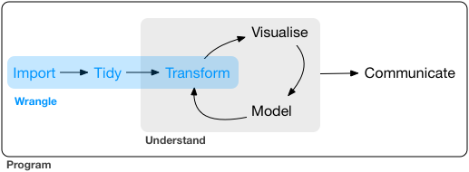

## dplyr {background-color="#34495e"}

### As cinco funções do dplyr

| Função | O que faz | Exemplo |
|--------|-----------|---------|
| `select()` | Seleciona **colunas** | `select(municipios, uf, idhm)` |
| `filter()` | Filtra **linhas** | `filter(municipios, uf == "SP")` |
| `mutate()` | Cria/modifica **colunas** | `mutate(municipios, log_pib = log(pib_per_capita))` |
| `summarise()` | Resume dados | `summarise(municipios, media = mean(idhm))` |
| `arrange()` | Ordena **linhas** | `arrange(municipios, desc(idhm))` |

## select {background-color="#34495e"}

### `select()` em ação

```{r}
municipios |>
  select(municipio, uf, regiao, idhm)
```

### `select()` — variações úteis

```{r}
# Por padrão no nome
municipios |>
  select(starts_with("perc"))
```

```{r}
# Removendo colunas
municipios |>
  select(-populacao, -gini)
```

## filter {background-color="#34495e"}

### `filter()` em ação

- Use `,` ou `&` para **E** e `|` para **OU**

```{r}
municipios |>
  filter(regiao == "Nordeste", idhm > 0.7)
```

### Dica: usar `%in%`

```{r}
municipios |>
  filter(uf %in% c("SP", "RJ", "MG")) |>
  select(municipio, uf, perc_votos_gov) |>
  head(8)
```

## mutate {background-color="#34495e"}

### `mutate()` em ação

```{r}
municipios |>
  mutate(
    margem_vitoria = abs(perc_votos_gov - 50),
    competitivo = margem_vitoria < 10,
    faixa_idh = case_when(
      idhm < 0.55 ~ "Muito Baixo",
      idhm < 0.70 ~ "Baixo",
      idhm < 0.80 ~ "Médio",
      TRUE ~ "Alto"
    )
  ) |>
  select(municipio, margem_vitoria, competitivo, faixa_idh) |>
  head(6)
```

### Funções úteis dentro de `mutate()`

```{r}
municipios |>
  mutate(
    log_pop = log(populacao),
    idhm_padronizado = (idhm - mean(idhm)) / sd(idhm),
    ranking_idhm = min_rank(desc(idhm))
  ) |>
  select(municipio, log_pop, idhm_padronizado, ranking_idhm) |>
  head(6)
```

## summarise {background-color="#34495e"}

### `summarise()` + `group_by()`

```{r}
municipios |>
  group_by(regiao) |>
  summarise(
    n = n(),
    idhm_medio = mean(idhm) |> round(3),
    voto_gov_medio = mean(perc_votos_gov) |> round(1),
    comparecimento = mean(taxa_comparecimento) |> round(2)
  )
```

### `count()` — atalho poderoso

```{r}
municipios |>
  count(regiao, sort = TRUE) |>
  mutate(prop = n / sum(n),
         prop = scales::percent(prop))
```

### `arrange()`

Ordena de acordo com as opções. Usar `desc()` para ordem decrescente:

```{r}
municipios |>
  select(municipio, uf, idhm) |>
  arrange(desc(idhm)) |>
  head(5)
```

### Exercício: análise regional

Usando `municipios`:

1. Crie uma variável `faixa_idh` (Baixo < 0.6, Médio 0.6-0.75, Alto > 0.75)
2. Agrupe por `regiao` e `faixa_idh`
3. Calcule o voto médio no governo e o número de municípios
4. Ordene por voto médio decrescente

## tidyr {background-color="#34495e"}

### Funções do tidyr

Enquanto o `dplyr` faz recortes e adições, o `tidyr` mexe no **formato** da tabela:

- `pivot_longer()` e `pivot_wider()`
- `separate()` e `unite()`
- `nest()` e `unnest()`

### `pivot_wider()` — espalhando

```{r}
votos_wide <- municipios |>
  mutate(faixa_idh = cut(idhm, breaks = c(0, 0.6, 0.75, 1),
                          labels = c("Baixo","Médio","Alto"))) |>
  group_by(regiao, faixa_idh) |>
  summarise(voto_medio = mean(perc_votos_gov) |> round(1), .groups = "drop") |>
  pivot_wider(names_from = faixa_idh, values_from = voto_medio)

votos_wide
```

### `pivot_longer()` — empilhando

```{r}
votos_wide |>
  pivot_longer(-regiao, names_to = "faixa_idh", values_to = "voto_medio")
```

### `separate()` e `unite()`

```{r}
# Criando exemplo a partir de municipios
mun_cod <- municipios |>
  mutate(uf_regiao = paste(uf, regiao, sep = "-")) |>
  select(municipio, uf_regiao) |>
  head(6)

mun_cod

mun_cod |>
  separate(uf_regiao, into = c("uf", "regiao"), sep = "-")
```

## Limpeza {background-color="#34495e"}

### Duplicatas e limpeza

```{r}
municipios |>
  distinct(regiao)
```

```{r}
#| eval: false

# janitor: padroniza nomes e encontra duplicatas
dados |> janitor::clean_names()
dados |> janitor::get_dupes(municipio)
```

### Valores ausentes

```{r}
# Contar NAs por coluna
municipios |>
  summarise(across(everything(), ~ sum(is.na(.x))))
```

## Joins {background-color="#34495e"}

### Dados relacionais

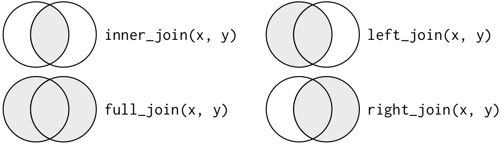

**PREFIRA LEFT JOIN**

### Exemplo: unindo informações

```{r}
# Resumo por UF a partir de municipios
indicadores_uf <- municipios |>
  group_by(uf) |>
  summarise(idhm_medio = mean(idhm) |> round(3), .groups = "drop") |>
  head(6)

# Informação complementar
gov_uf <- tibble(
  uf = c("SP", "RJ", "MG", "BA", "RS", "CE"),
  governador = c("Tarcísio", "Cláudio", "Zema",
                 "Jerônimo", "Leite", "Elmano")
)
```

### Left join

```{r}
indicadores_uf |>
  left_join(gov_uf, by = "uf")
```

### Outros joins

```{r}
# inner: só mantém as chaves presentes em AMBAS
indicadores_uf |>
  inner_join(gov_uf, by = "uf")
```

```{r}
# anti: quem NÃO tem correspondência
indicadores_uf |>
  anti_join(gov_uf, by = "uf")
```

# Aula 4 — Visualizando e Mapeando {background-color="#2c3e50"}

## Visualização de dados {background-color="#34495e"}

### Onde estamos?

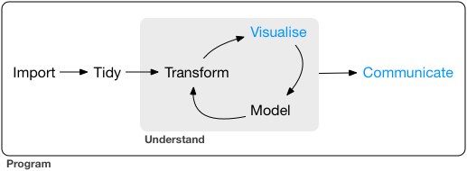


### Uma exibição gráfica deve (Edward Tufte)

- **Foco na substância:** Induzir o observador a pensar nos dados, não na metodologia ou no design gráfico.
- **Integridade:** Evitar distorções e apresentar números de forma coerente.
- **Quatro princípios práticos:**
  1. Miniaturas múltiplas (*small multiples*)
  2. Menor diferença efetiva
  3. Causalidade ("comparado com o quê?")
  4. Contexto

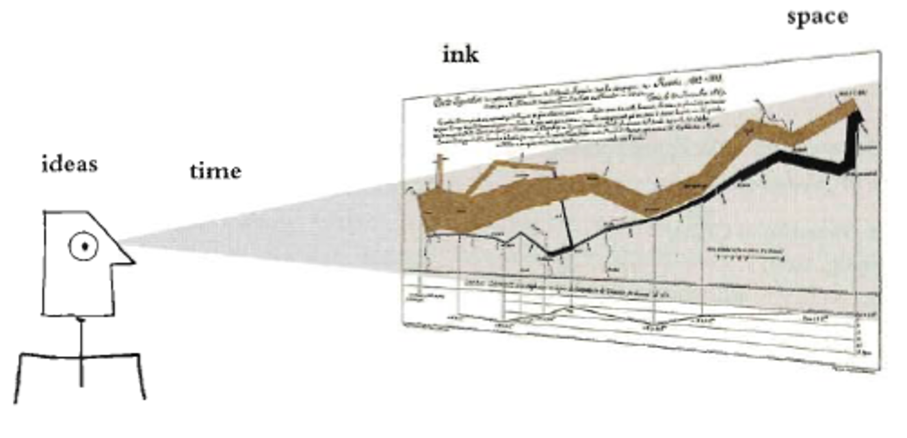
### O que você quer mostrar?
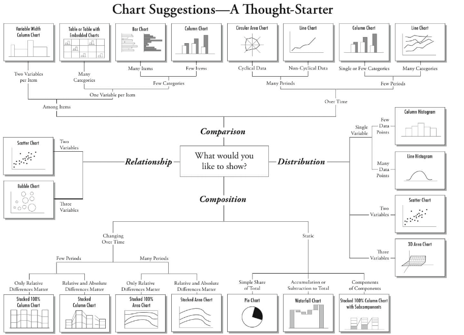

### O Gráfico Ideal
[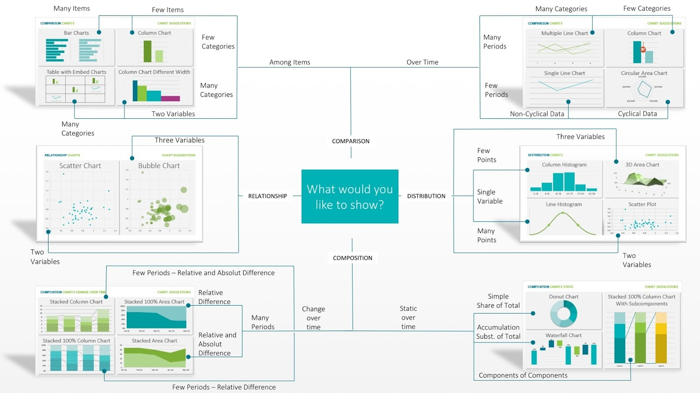](https://www.techprevue.com/decision-tree-perfect-visualisation-data/)


## ggplot {background-color="#34495e"}

### Elementos do ggplot

- Dados (`data = `)
- Geometrias (`geom_point`, `geom_col`, `geom_histogram`, `geom_boxplot`...)
- Estéticas (`aes()`: `x`, `y`, `color`, `fill`, `shape`, `size`)
- Escalas (`scale_color_`, `scale_fill_`, `scale_x_continuous`)
- Tema e Facet

Recursos: [R Graphics Cookbook](https://r-graphics.org/) | [R Graph Gallery](https://www.r-graph-gallery.com/) | [Extensões](https://exts.ggplot2.tidyverse.org/gallery/)

### Gráfico de barras

```{r}
municipios |>
  group_by(regiao) |>
  summarise(voto_medio = mean(perc_votos_gov)) |>
  ggplot(aes(x = reorder(regiao, voto_medio), y = voto_medio, fill = regiao)) +
  geom_col() +
  coord_flip() +
  labs(title = "Votação Média no Governo por Região",
       x = "", y = "% Votos no Governo") +
  theme_minimal() +
  theme(legend.position = "none")
```

### Dispersão: Bases Socioeconômicas do Voto

```{r}
municipios |>
  ggplot(aes(x = idhm, y = perc_votos_gov, color = regiao)) +
  geom_point(alpha = 0.5) +
  geom_smooth(method = "lm", se = FALSE, color = "black", linetype = "dashed") +
  labs(title = "Desenvolvimento local e apoio ao incumbente",
       x = "IDHM", y = "% Votos no Governo", color = "Região") +
  theme_minimal()
```

### Histograma

```{r}
municipios |>
  ggplot(aes(x = idhm, fill = regiao)) +
  geom_histogram(bins = 30, alpha = 0.6, position = "identity") +
  labs(title = "Distribuição do IDHM por Região",
       x = "IDHM", y = "Frequência", fill = "Região") +
  theme_minimal()
```

### Boxplot + Facets

```{r}
municipios |>
  mutate(faixa_idh = cut(idhm, breaks = c(0, 0.6, 0.75, 1),
                          labels = c("Baixo","Médio","Alto"))) |>
  ggplot(aes(x = faixa_idh, y = perc_votos_gov, fill = faixa_idh)) +
  geom_boxplot(alpha = 0.7) +
  facet_wrap(~regiao) +
  labs(title = "Distribuição do Voto por IDH e Região",
       x = "Faixa de IDH", y = "% Votos no Governo") +
  theme_minimal() +
  theme(legend.position = "none")
```

### Heatmap

```{r}
municipios |>
  mutate(faixa_idh = cut(idhm, breaks = c(0, 0.6, 0.75, 1),
                          labels = c("Baixo","Médio","Alto"))) |>
  group_by(regiao, faixa_idh) |>
  summarise(voto_medio = mean(perc_votos_gov), .groups = "drop") |>
  ggplot(aes(x = faixa_idh, y = regiao, fill = voto_medio)) +
  geom_tile(color = "white") +
  geom_text(aes(label = round(voto_medio, 1)), color = "white", fontface = "bold") +
  scale_fill_gradient2(low = "steelblue", mid = "white", high = "firebrick",
                       midpoint = 50) +
  labs(title = "Votação Média: Região × IDH", x = "Faixa IDH", y = "") +
  theme_minimal()
```

### Escalas divergentes

```{r}
municipios |>
  ggplot(aes(x = idhm, y = pib_per_capita, color = perc_votos_gov)) +
  geom_point(alpha = 0.6, size = 2) +
  scale_color_gradient2(low = "steelblue", mid = "white", high = "firebrick",
                        midpoint = 50, name = "% Voto Gov") +
  scale_y_log10(labels = scales::dollar_format(prefix = "R$ ")) +
  labs(title = "PIB per Capita, IDHM e Voto",
       x = "IDHM", y = "PIB per Capita (escala log)") +
  theme_minimal()
```

### Combinando gráficos com patchwork

```{r}
p1 <- municipios |>
  ggplot(aes(x = idhm, y = perc_votos_gov)) +
  geom_point(alpha = 0.3) + geom_smooth(method = "lm") +
  labs(title = "IDHM × Voto", x = "IDHM", y = "% Gov") + theme_minimal()

p2 <- municipios |>
  ggplot(aes(x = regiao, fill = regiao)) +
  geom_bar() + coord_flip() +
  labs(title = "Municípios por Região", x = "", y = "N") +
  theme_minimal() + theme(legend.position = "none")

p1 + p2 + plot_annotation(title = "Dashboard Eleitoral")
```

### Gráficos interativos

```{r}
#| eval: false

# ggiraph: ggplot interativo
pacman::p_load(ggiraph)
g <- municipios |>
  ggplot(aes(x = idhm, y = perc_votos_gov, tooltip = municipio)) +
  geom_point_interactive(alpha = 0.5)
girafe(ggobj = g)

# plotly: converte ggplot em interativo
pacman::p_load(plotly)
p <- municipios |>
  ggplot(aes(x = idhm, y = perc_votos_gov, color = regiao)) +
  geom_point(alpha = 0.5)
ggplotly(p)
```

## Mapas: sf + geobr {background-color="#34495e"}

### Por que sf + geobr?

- `sf` (Simple Features) — o padrão para dados geoespaciais no R
- `geobr` — malhas geográficas do IBGE prontas para uso

```{r}
estados_br <- read_state(year = 2020, showProgress = FALSE)
```

### Mapa coroplético: votação por estado

```{r}
dados_uf <- municipios |>
  group_by(uf) |>
  summarise(voto_medio = mean(perc_votos_gov), .groups = "drop")

mapa <- estados_br |>
  left_join(dados_uf, by = c("abbrev_state" = "uf"))

ggplot(mapa) +
  geom_sf(aes(fill = voto_medio), color = "white", linewidth = 0.2) +
  scale_fill_gradient2(low = "steelblue", mid = "white", high = "firebrick",
                       midpoint = 50, name = "% Gov") +
  theme_void() +
  labs(title = "Votação Média no Governo por Estado")
```

### Mapa com capitais

```{r}
capitais_geo <- read_municipal_seat(showProgress = FALSE)
```

```{r}
ggplot() +
  geom_sf(data = estados_br, fill = "grey95", color = "grey60") +
  geom_sf(data = capitais_geo, color = "firebrick", size = 1.5, alpha = 0.7) +
  theme_void() +
  labs(title = "Capitais Brasileiras")
```

## Pontos Ideais {background-color="#34495e"}

### A intuição

Se observarmos como parlamentares **votam** em diversas matérias, podemos inferir suas **posições ideológicas** em um espaço latente.

Método **DW-NOMINATE** (Poole & Rosenthal): a partir de centenas de votações, estima onde cada parlamentar se localiza num eixo.

No Brasil: o eixo principal é frequentemente **governo-oposição** (Zucco & Lauderdale, 2011).

### Simulando votações nominais

```{r}
set.seed(2025)
n_parl <- 40
n_vot <- 80

# Posições ideológicas "verdadeiras"
posicao_ideal <- c(rnorm(10, -1.5, 0.3), rnorm(10, -0.3, 0.4),
             rnorm(10, 0.5, 0.4), rnorm(10, 1.5, 0.3))
bloco <- rep(c("Esquerda","Centro-Esq","Centro-Dir","Direita"), each = 10)

# Simular votos
pontos_corte <- runif(n_vot, -2, 2)
votos_mat <- matrix(NA, n_parl, n_vot)
for(j in 1:n_vot) {
  votos_mat[, j] <- rbinom(n_parl, 1, plogis(2 * (posicao_ideal - pontos_corte[j])))
}
```

### Estimando pontos ideais via PCA

```{r}
pca <- prcomp(votos_mat, center = TRUE, scale. = TRUE)

pontos <- tibble(
  bloco = bloco,
  posicao_real = posicao_ideal,
  pc1 = pca$x[, 1],
  pc2 = pca$x[, 2]
)
```

### Mapa do Plenário

```{r}
ggplot(pontos, aes(x = pc1, y = pc2, color = bloco)) +
  geom_point(size = 3, alpha = 0.8) +
  scale_color_manual(values = c("Esquerda" = "red", "Centro-Esq" = "salmon",
                                 "Centro-Dir" = "lightblue", "Direita" = "darkblue")) +
  geom_vline(xintercept = 0, linetype = "dashed", alpha = 0.3) +
  labs(title = "Mapa Espacial do Plenário",
       subtitle = "Pontos ideais estimados via PCA sobre votações simuladas",
       x = "1ª Dimensão (Gov-Oposição)", y = "2ª Dimensão", color = "Bloco") +
  theme_minimal()
```

### Validação: posição real vs estimada

```{r}
ggplot(pontos, aes(x = posicao_real, y = pc1, color = bloco)) +
  geom_point(size = 3) +
  geom_smooth(method = "lm", se = FALSE, color = "grey30", linetype = "dashed") +
  scale_color_manual(values = c("Esquerda" = "red", "Centro-Esq" = "salmon",
                                 "Centro-Dir" = "lightblue", "Direita" = "darkblue")) +
  labs(title = "Posição Real vs. Estimada",
       x = "Posição Ideológica Real", y = "PC1 (estimada)", color = "Bloco") +
  theme_minimal()
```

### Na prática: API da Câmara

```{r}
#| eval: false

# Coletar votos de uma votação real
id_votacao <- "2372912"

url_votos <- paste0(
  "https://dadosabertos.camara.leg.br/api/v2/votacoes/",
  id_votacao, "/votos"
)

votos <- request(url_votos) |>
  req_perform() |>
  resp_body_json() |>
  pluck("dados") |>
  map_dfr(~ tibble(
    nome = .x$deputado_$nome,
    partido = .x$deputado_$siglaPartido,
    voto = .x$tipoVoto
  ))
```

# Aula 5 — Comunicando seus Dados {background-color="#2c3e50"}

## Reprodutibilidade e Quarto

### O que é Quarto?

- Comunicar com tomadores de decisão, que querem **conclusões**, não código
- Colaborar com outros cientistas de dados, interessados em conclusões **e** código
- Um caderno de laboratório moderno

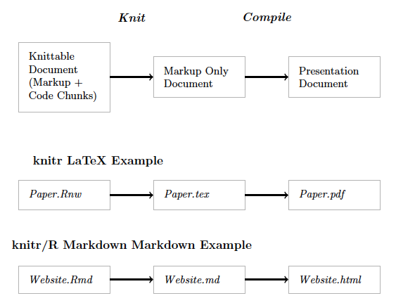

### Quarto: evolução do R Markdown

- Suporte multilíngue (R, Python, Julia)
- Gera **PDF**, **HTML**, **slides**, **Word** — tudo do mesmo arquivo
- Referências bibliográficas com BibTeX
- Código e texto integrados = **reprodutibilidade**

Estas slides foram feitas em Quarto!

### Estrutura de um documento Quarto

```yaml
---
title: "Meu Artigo"
author: "Seu Nome"
format: pdf
---

## Introdução

Texto aqui, com código:
```

```{r}
#| eval: false

# Chunks de R ficam entre ```{r} e ```
summary(municipios$idhm)
```

### Formatos de saída

| Formato | Uso | Comando |
|---------|-----|---------|
| `html` | Web, blogs | `format: html` |
| `pdf` | Artigos, relatórios | `format: pdf` |
| `revealjs` | Apresentações | `format: revealjs` |
| `docx` | Word | `format: docx` |

Outros: [bookdown](https://bookdown.org/) (livros), flexdashboard, Shiny, Beamer

### Opções de chunk

```{r}
#| eval: false

#| echo: false      # esconde o código
#| eval: false       # não executa
#| warning: false    # esconde avisos
#| fig-cap: "Minha figura"  # legenda
#| fig-width: 8      # largura
```

### Tabelas com `knitr::kable()`

```{r}
municipios |>
  group_by(regiao) |>
  summarise(
    n = n(),
    idhm_medio = mean(idhm) |> round(3),
    voto_medio = mean(perc_votos_gov) |> round(1)
  ) |>
  knitr::kable(col.names = c("Região", "N", "IDHM Médio", "% Voto Gov"))
```

### Tabelas de regressão com `modelsummary()`

```{r}
modelo1 <- lm(perc_votos_gov ~ idhm, data = municipios)
modelo2 <- lm(perc_votos_gov ~ idhm + log(populacao), data = municipios)
modelo3 <- lm(perc_votos_gov ~ idhm + log(populacao) + pib_per_capita + regiao,
              data = municipios)

modelsummary(
  list("Bivariado" = modelo1, "Controle Pop." = modelo2, "Completo" = modelo3),
  stars = TRUE, gof_omit = "AIC|BIC|Log|RMSE"
)
```

### Referências bibliográficas

No cabeçalho YAML:

```yaml
bibliography: referencias.bib
csl: apsa.csl
```

No texto: `@lipset1959` ou `[@lipset1959]`

O Quarto gera automaticamente a lista de referências ao final do documento.

### Reprodutibilidade: regras de ouro

1. **`set.seed()`** antes de qualquer aleatoriedade
2. **Caminhos relativos** (nunca `/home/fred/...`)
3. **RProjects** (.Rproj) para definir o diretório
4. **`pacman::p_load()`** para centralizar pacotes
5. **Quarto** para integrar código + texto

### Fluxo reprodutível

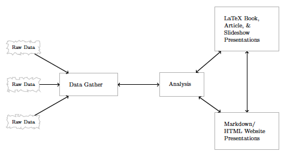

### Organização de projeto

```
meu_projeto/
├── meu_projeto.Rproj
├── dados/
│   ├── brutos/
│   └── processados/
├── scripts/
│   ├── 01_limpeza.R
│   ├── 02_analise.R
│   └── 03_visualizacao.R
├── resultados/
│   ├── figuras/
│   └── tabelas/
└── relatorio.qmd
```

### Git e GitHub

- **Git**: controle de versão (registra tudo que você muda)
- **GitHub**: repositório remoto (backup + colaboração)
- RStudio tem integração nativa (aba "Git")

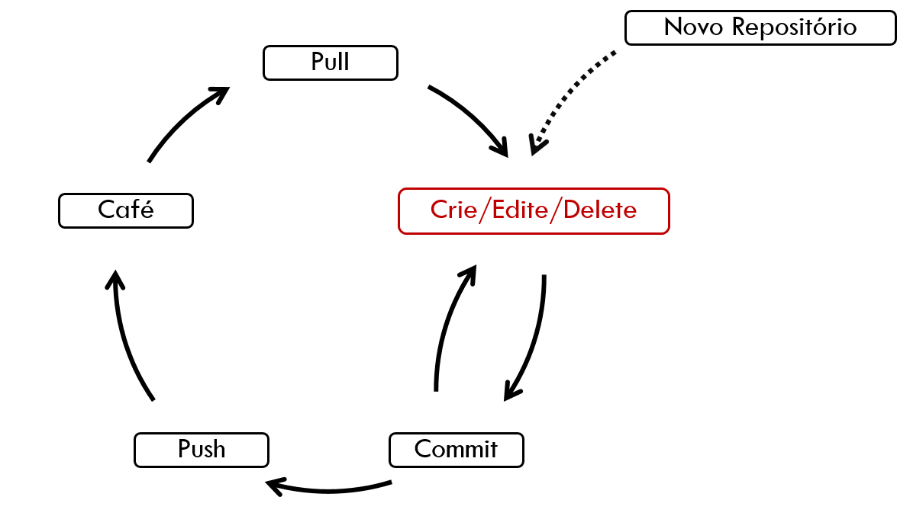

Recurso: [Happy Git with R](https://happygitwithr.com/)

### Novos caminhos e próximos passos

- **Shiny**: aplicações web interativas
- **tidymodels**: machine learning no tidyverse
- **quanteda**: análise de texto político
- **targets**: pipelines automatizados

:::{.callout-tip}
A melhor forma de aprender R é **praticando com seus próprios dados**!
:::

### Obrigado! {background-color="#2c3e50"}

**Frederico Bertholini**

IPOL/UnB

Escola de Métodos em Ciências Sociais 2026

:::{.callout-note}
Todo o material do curso está disponível em:

<https://github.com/ipol-unb/emcs2026>
:::
